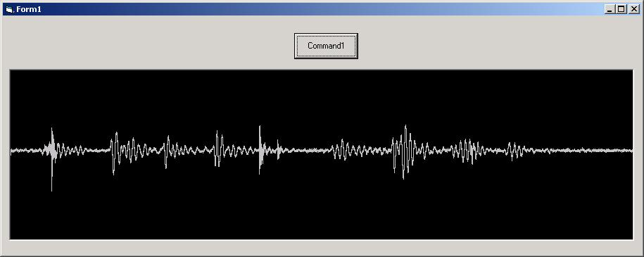



## Waveform Graphing

### Description

Loads a .wav file and Processes it, seperating the chunks, and graphs it.

Basiclly just shows how to read a standard pcm .wav file manually. Coded this for a project i was working on. This code loads the complete data chunk of the waveform into memory, but could be *easly* changed to only load a few samples or seconds of data. Coded this from scratch using a couple of documents on the wav file format, as all the vb code examples i could find on here were pretty messy.

Wave data is placed in one of two UDT's either WaveData8bit_ or WaveData16bit_ and can be accessed by .ChannelData(Channel,Sample)

(btw, this is my first time posting here, sorry if i have done something 'naughty' :P)
 
### More Info
 

             |
---                |---
**Submitted On**   |2003-06-05 19:03:02
**By**             |[phrizer \(lance\)](https://github.com/Planet-Source-Code/PSCIndex/blob/master/ByAuthor/phrizer-lance.md)
**Level**          |Intermediate
**User Rating**    |4.5 (18 globes from 4 users)
**Compatibility**  |VB 5\.0, VB 6\.0
**Category**       |[Sound/MP3](https://github.com/Planet-Source-Code/PSCIndex/blob/master/ByCategory/sound-mp3__1-45.md)
**World**          |[Visual Basic](https://github.com/Planet-Source-Code/PSCIndex/blob/master/ByWorld/visual-basic.md)
**Archive File**   |[Waveform\_G159733652003\.zip](https://github.com/Planet-Source-Code/phrizer-lance-waveform-graphing__1-45988/archive/master.zip)

